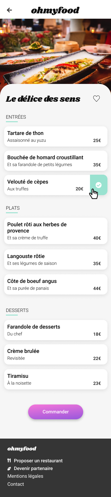
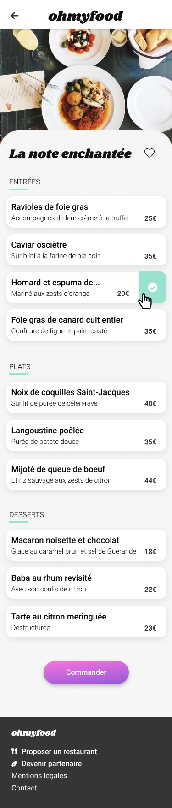

# Ohmyfood
Réalisation d'un site mobile à partir de maquettes.

## Tester le site

https://j-portofolio.github.io/Ohmyfood/

## Liste des pages/maquettes:

### Page d'accueil

### Menu - À la française

### Menu - La palette du goût

### Menu - Le délice des sens --

### Menu - La note enchantée

